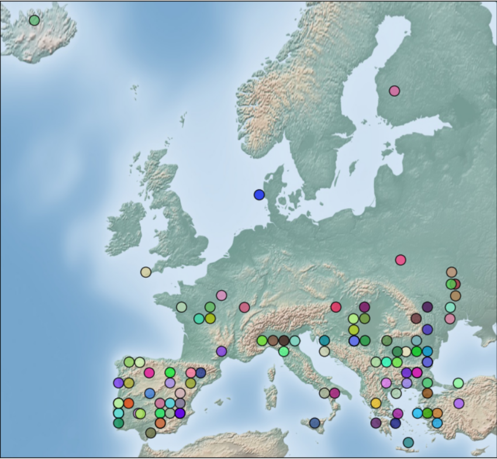

# SEN23E: A CLOUDLESS GEO-REFERENCED MULTI-SPECTRAL SENTINEL-2/SENTINEL-3 DATASET FOR DATA FUSION ANALYSIS

[Damian Ibañez](https://ieeexplore.ieee.org/author/37088513937), [Ruben Fernandez-Beltran](https://scholar.google.es/citations?user=pdzJmcQAAAAJ&hl=es), [Filiberto Pla](https://scholar.google.es/citations?user=mSSPcAMAAAAJ&hl=es)
---

This repository contains the dataset for the IGARSS2022 paper: This repository contains the dataset for the IGARSS2022 paper: [SEN23E: A CLOUDLESS GEO-REFERENCED MULTI-SPECTRAL SENTINEL-2/SENTINEL-3 DATASET FOR DATA FUSION ANALYSIS](https://ieeexplore.ieee.org/document/9883867). The availability of geo-referenced coupled data of different platforms is essential to train remote sensing (RS) multi-modal classification and bio-phyiscal parameter estimation learning methods. To properly develop a generalizing model different scenes and topographies are required. For this purpose, different multi-modal datasets have been published for the last years. Nevertheless, to our knowledge there is not any dataset composed of Sentinel-2 (S2) and Sentinel-3 (S3) geo-referenced images. In this paper we present SEN23, a dataset composed of 100 complete multi-spectral S2 and S3 paired images of different locations along Europe from the 2021 summer. The coupled images were obtained with a time difference of three or less days, containing less than a 1\% of cloud coverage and have a resolution difference of $\times15$. SEN23E is expected to help with the development of new multi-spectral, multi-resolution and multi-modal models for complex tasks which need context and complete images.




## Dataset

The complete dataset and information of every coupled Sentinel-2/Sentinel-3 pair used in the experimentation can be found in this [link].([https://tinyurl.com/yfrpdeww](https://ujies.sharepoint.com/:f:/s/Z365-EVP/EkRcg_Ivy0JNh39AbfF5l98BY05fXkfbmFnWgWayH8EqWQ?e=tXqhjO)

## Citation

```
D. Ibañez, R. Fernandez-Beltran and F. Pla, "SEN23E: A Cloudless Geo-Referenced Multi-Spectral Sentinel-2/Sentinel-3 Dataset for Data Fusion Analysis," IGARSS 2022 - 2022 IEEE International Geoscience and Remote Sensing Symposium, Kuala Lumpur, Malaysia, 2022, pp. 1448-1451, doi: 10.1109/IGARSS46834.2022.9883867.


```

## References

[1]  R. Fernandez-Beltran, D. Ibanez, J. Kang, and F. Pla, “Time-resolved Sentinel-3 vegetation indices via inter-sensor 3-d convolutional regression networks,” IEEE Geoscience and Remote Sensing Letters, 2021.

[2] D. Ibañez, R. Fernandez-Beltran, F. Pla and N. Yokoya, "DAT-CNN: Dual Attention Temporal CNN for Time-Resolving Sentinel-3 Vegetation Indices," in IEEE Journal of Selected Topics in Applied Earth Observations and Remote Sensing, vol. 15, pp. 2632-2643, 2022, doi: 10.1109/JSTARS.2022.3161190.
